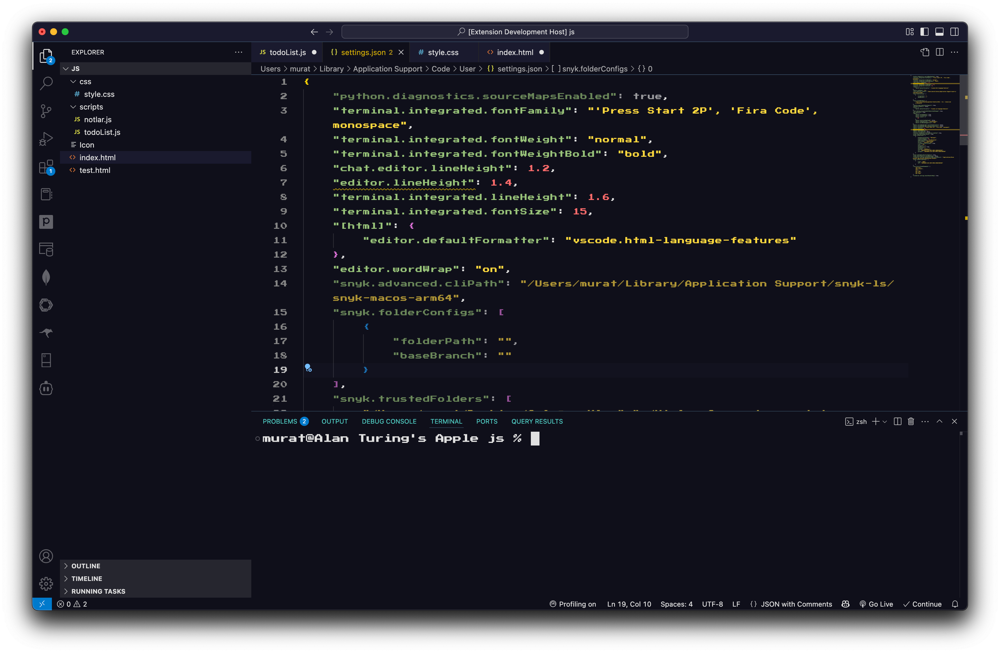
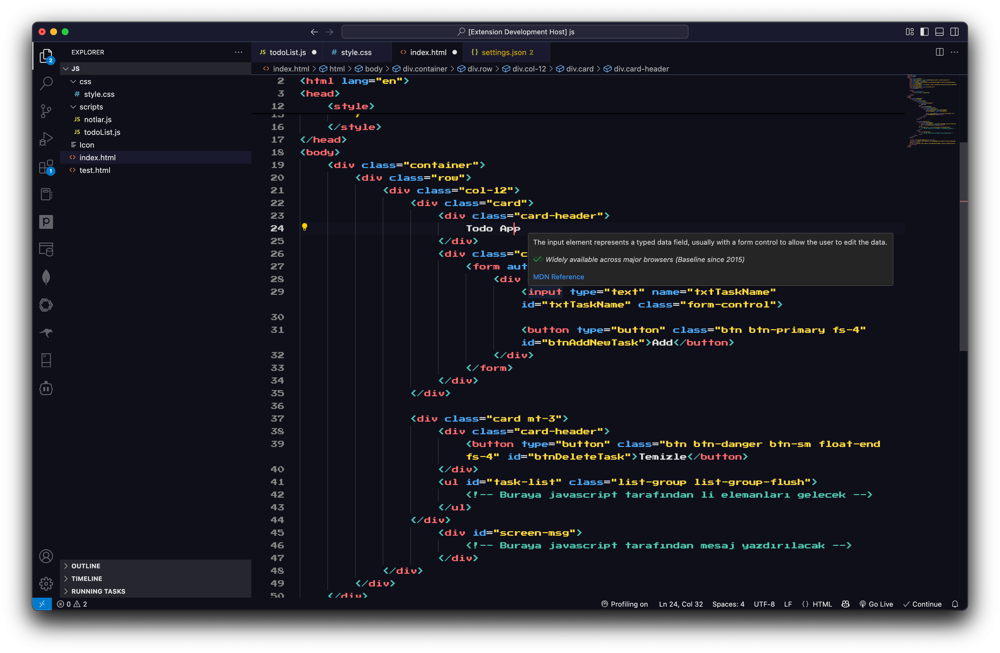
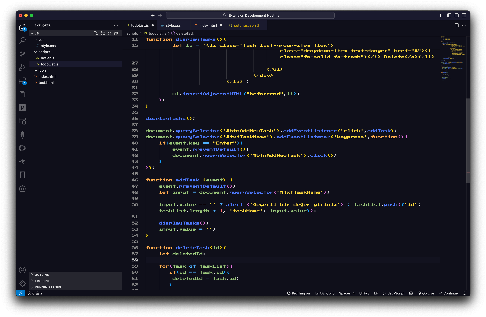
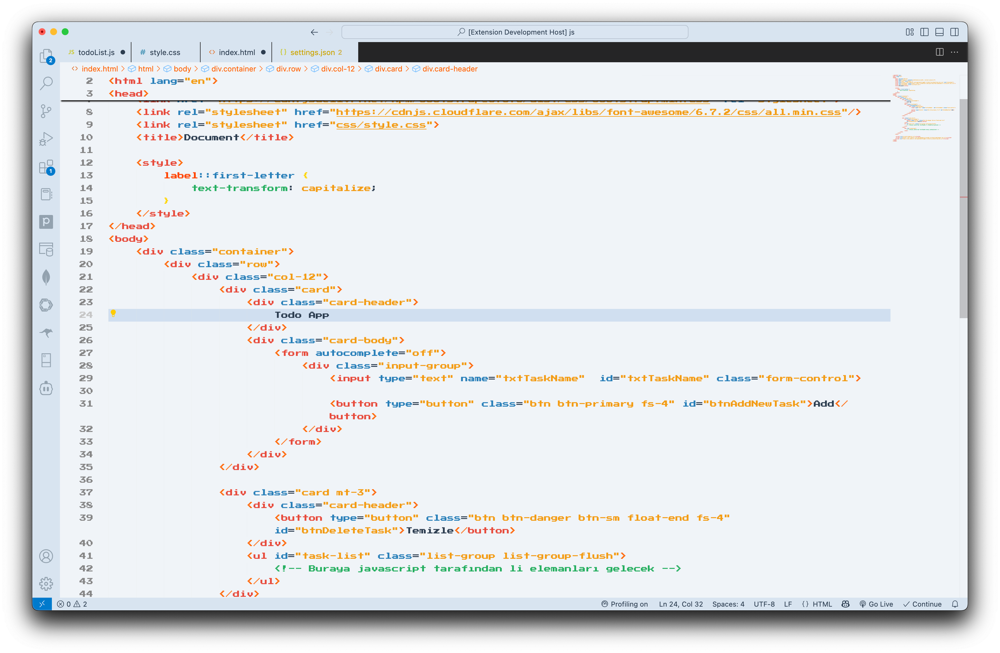
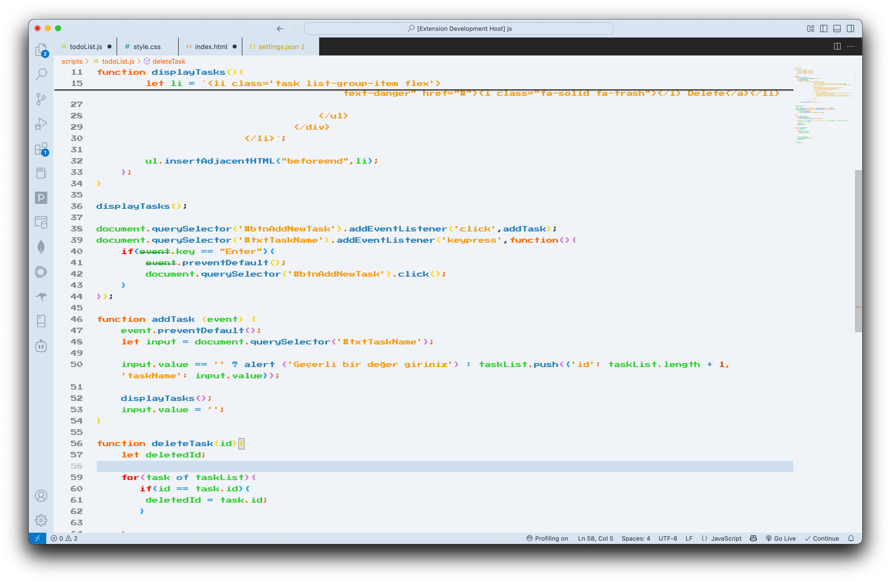

# 8bitCave Theme

A retro-inspired VS Code theme that brings the nostalgic charm of 8-bit aesthetics to your modern development environment.

## Recommended Settings

To fully embrace the retro aesthetic of the 8bitCave Theme, we recommend using the following font settings in your VS Code `settings.json`:

```json
{
  "editor.fontFamily": "'Press Start 2P', 'Fira Code', Consolas, 'Courier New', monospace",
  "editor.fontSize": 15,
  "terminal.integrated.fontFamily": "'Press Start 2P', 'Fira Code', Consolas, 'Courier New', monospace",
  "terminal.integrated.fontSize": 15
}
```

These settings combine the pixelated look of 'Press Start 2P' with the readability and ligatures of 'Fira Code'. You can, of course, use any font you prefer.

Below is a screenshot showing an example of these recommended settings in action:



## Previews

Here are some previews of the 8bitCave Theme:










## Features

- Retro-inspired color palette
- Carefully crafted syntax highlighting
- Optimized for long coding sessions
- Dark theme optimized for eye comfort
- Support for all major programming languages

## Installation

1. Open VS Code
2. Press `Ctrl+Shift+X` (Windows/Linux) or `Cmd+Shift+X` (Mac) to open the Extensions view
3. Search for "8bitCave"
4. Click "Install"

## Usage

After installation, you can activate the theme by:

1. Press `Ctrl+K Ctrl+T` (Windows/Linux) or `Cmd+K Cmd+T` (Mac) to open the theme selector
2. Select "8bitCave" from the list

Or:

1. Go to `Code > Preferences > Color Theme` (Mac) or `File > Preferences > Color Theme` (Windows/Linux)
2. Select "8bitCave" from the list

## Color Palette

The theme uses a carefully selected palette of colors inspired by classic 8-bit games:

- Background: `#1E1E1E`
- Foreground: `#D4D4D4`
- Accent: `#569CD6`
- Comments: `#6A9955`
- Strings: `#CE9178`
- Keywords: `#C586C0`
- Functions: `#DCDCAA`
- Variables: `#9CDCFE`

## Contributing

Contributions are welcome! Please feel free to submit a Pull Request.

1. Fork the repository
2. Create your feature branch (`git checkout -b feature/amazing-feature`)
3. Commit your changes (`git commit -m 'Add some amazing feature'`)
4. Push to the branch (`git push origin feature/amazing-feature`)
5. Open a Pull Request

## License

This project is licensed under the MIT License - see the [LICENSE](LICENSE) file for details.

## Acknowledgments

- Inspired by classic 8-bit games and retro computing
- Thanks to all contributors and users of the theme
- Special thanks to the VS Code team for their amazing editor

## Contact

If you have any questions or suggestions, please feel free to open an issue on GitHub.

---

Made with ❤️ by the muratalpaslan